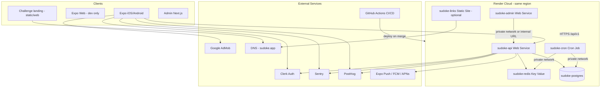

# Sudoke — Infrastructure Epics (Gap Analysis)

**Sources:** `competitive_social_sudoku_prd.md` (v0.2), `EPIC_PLAN_UPDATED.md` (2026-06-18), repository audit (2026-06-19)  
**Purpose:** Single roadmap for **everything infrastructure-related that is missing** from the repo, the epic plan, or the PRD — cloud services, networking, secrets, third-party accounts, mobile distribution, and operational hardening.  
**Platform decision (PRD §23.3):** Render Cloud first; AWS deferred unless Render becomes insufficient.

---

## Executive Summary

The product codebase is ~70–95% through early epics locally, but **cloud infrastructure is still not provisioned**. Local dev has Docker Compose (Postgres + Redis + API), GitHub Actions CI (no deploy, no Playwright), optional Sentry hooks, repo-side staging `render.yaml`, and expanded env examples. There are still **no live Render staging/production services**, mobile build pipeline (EAS), domain/deep-link hosting, push notification credentials, PostHog, AdMob, Clerk apps/credentials, challenge web landing, production admin auth, backup/monitoring alerts, or production secrets.

This document turns those gaps into ordered **Infrastructure Epics (I0–I12)** that can be executed in parallel with product epics but **must complete before Epic 10 soft launch**.

---

## Repository Baseline (What Exists)

| Area | Status | Evidence |
|------|--------|----------|
| Local Postgres + Redis | ✅ | `docker-compose.yml` |
| API container image | ✅ (API only) | `apps/api/Dockerfile` |
| FastAPI health + readiness | ✅ | `/api/v1/health`, `/api/v1/health/ready` (DB + Redis ping) |
| Cron worker code (not deployed) | ✅ | `apps/api/src/jobs/worker.py`, `tick.py` |
| Alembic migrations | ✅ | `0001_baseline`, `0002_rating_leaderboards` |
| GitHub Actions CI | ✅ (no deploy) | `.github/workflows/ci.yml` — lint, typecheck, pytest |
| Env templates | ✅ expanded | `.env.example`, `apps/api/.env.example`, `apps/admin/.env.example`, `apps/mobile/.env.example` |
| Redis in app logic | ⚠️ health check only | No queue/cache usage beyond ping |
| Sentry | ⚠️ API optional only | `apps/api/src/main.py`; mobile dep present, not initialized |
| Clerk | ⚠️ repo-side wiring | API verifies Clerk JWKS outside dev; mobile mounts ClerkProvider/token bridge when configured; credentials/OAuth QA/webhooks remain |
| Mobile API URL | ✅ env-backed | `EXPO_PUBLIC_API_BASE_URL` with local fallback |
| Admin deployment | ❌ | Next.js dev server only; no Dockerfile / Render service |
| Render / cloud IaC | ⚠️ repo-side only | `render.yaml` staging Blueprint exists; live services not created |
| EAS / store pipeline | ❌ | No `eas.json`, no store accounts documented |
| Domains / universal links | ❌ | `app.json` has `scheme: sudoke` only; no `associatedDomains` |
| Challenge web landing | ❌ | PRD §5.2 requires non-playable web card; only in-app stub |
| PostHog | ❌ | PRD §29 |
| Push notifications infra | ⚠️ partial | Server-side device registry (`push_tokens`) + preference-aware Expo dispatch landed (gated by `EXPO_PUSH_ENABLED`, off by default); native `expo-notifications` + APNs/FCM creds pending (PRD §19) |
| AdMob infra | ❌ | PRD §20 |
| Playwright CI | ❌ | Epic 3 exit criteria; not in CI |
| DB tables for future epics | ⚠️ partial | `friend_requests`, `challenges`, `user_streaks`, `notification_preferences`, and `push_tokens` now exist (Epics 6/8); ads + analytics tables remain per PRD §27 |
| Puzzle content in cloud DB | ❌ | Local bank under `data/` (gitignored); not loaded to any environment |
| Production CORS | ⚠️ env-backed | `CORS_ALLOWED_ORIGINS` supported; staging/prod values must be set |
| Backups / PITR / job alerts | ❌ | Not configured |

### PRD vs Repo Architectural Notes

| Topic | PRD | Repo today | Infra implication |
|-------|-----|------------|-------------------|
| Admin UI | §21.1: “part of same FastAPI/Render backend” | Separate `apps/admin` Next.js app | Deploy admin as its own Render **Web Service** (or later fold into API); protect with Clerk + IP allowlist |
| Background worker | §23.2: worker + cron | Cron tick only; no Redis queue worker | **Cron Job** on Render is sufficient for MVP; optional **Worker** service if async queue added |
| File storage | Puzzles in Postgres (§22) | No S3/blob layer | **No object storage required for MVP** unless avatars/uploads are added (currently `avatar_url` string only) |
| Full playable web | Excluded (§33) | Expo Web for dev proxy only | Do **not** provision playable web Sudoku infra |

---

## Target Render Topology (Staging + Production)



**Render private network (same region):** API, Cron, Admin, Postgres, and Key Value should use **internal connection URLs** (`fromDatabase` / `fromService` in Blueprint). Public internet only for mobile clients, challenge landing, and admin operators.

---

## Secrets & Environment Variables Catalog

### Backend (`apps/api`) — Render Web Service + Cron

| Variable | Required when | Source | Notes |
|----------|---------------|--------|-------|
| `DATABASE_URL` | Always | Render `fromDatabase.connectionString` | Must be `postgresql+asyncpg://…` (transform Render URL if needed) |
| `REDIS_URL` | Always | Render `fromService` (keyvalue) `connectionString` | Use **internal** URL on private network |
| `ENVIRONMENT` | Always | Literal: `staging` / `production` | Controls CORS, dev auth bypass, log format |
| `API_V1_PREFIX` | Always | `/api/v1` | Keep consistent across envs |
| `CLERK_SECRET_KEY` | Staging+ | Clerk Dashboard | Server-side JWT verification + webhooks |
| `CLERK_PUBLISHABLE_KEY` | Staging+ | Clerk Dashboard | Optional on API if needed for JWKS metadata |
| `CLERK_JWKS_URL` or `CLERK_ISSUER` | Production | Clerk Dashboard | Required by implemented JWT signature verification |
| `CLERK_WEBHOOK_SIGNING_SECRET` | Production | Clerk Webhooks | User sync / deletion (PRD §30.1) |
| `SENTRY_DSN` | Staging+ | Sentry project | Separate projects per env recommended |
| `SENTRY_AUTH_TOKEN` | CI only | Sentry | Source map upload (if mobile/backend symbols) |
| `POSTHOG_API_KEY` | Epic 10 | PostHog | Server-side events (PRD §29) |
| `POSTHOG_HOST` | Epic 10 | PostHog | e.g. `https://us.i.posthog.com` |
| `CORS_ALLOWED_ORIGINS` | Staging+ | Env config | Comma-separated; must include admin origin, Expo web dev origin |
| `ADMIN_DEV_BYPASS_ENABLED` | Never in prod | Literal `false` | Guard `X-Dev-Auth-User` (currently dev-only) |
| `DAILY_RESET_UTC_HOUR` | Optional | App config / `app_config` table | If not DB-driven |
| `EXPO_ACCESS_TOKEN` | Epic 8 | Expo account | Sending push via Expo Push API from API |
| `EXPO_PUSH_ENABLED` | Epic 8 | Literal `false` until creds | Master switch for server-side push dispatch; off = safe no-op |
| `CRON_SECRET` | Optional | `generateValue: true` | If cron invoked via HTTP instead of CLI |

**Repo-side status:** API env examples now include `CORS_ALLOWED_ORIGINS`, Clerk issuer/JWKS/webhook placeholders, `POSTHOG_*`, `EXPO_ACCESS_TOKEN`, and `EXPO_PUSH_ENABLED`. Real staging/prod values remain manual secrets.

### Admin (`apps/admin`) — Render Web Service

| Variable | Required when | Source | Notes |
|----------|---------------|--------|-------|
| `API_BASE_URL` | Always | Render internal API URL or public `https://api.sudoke.app/api/v1` | Prefer **private network** URL for server-side fetches |
| `ADMIN_AUTH_PROVIDER_ID` | Dev only | — | Replace with real Clerk session in staging+ |
| `ADMIN_API_BEARER` | Staging+ | Clerk session JWT or service token | Server-side only; never `NEXT_PUBLIC_*` |
| `CLERK_SECRET_KEY` | Staging+ | Clerk | If admin uses Clerk middleware (recommended) |
| `NEXT_PUBLIC_CLERK_PUBLISHABLE_KEY` | Staging+ | Clerk | Browser sign-in for admins |
| `NODE_ENV` | Always | `production` on Render | |

**Repo-side status:** `apps/admin/.env.example` exists. Production admin auth still needs Clerk middleware/session-to-API bearer wiring; `X-Dev-Auth-User` remains local development only on the API.

### Mobile (`apps/mobile`) — EAS Build / local

| Variable | Required when | Source | Notes |
|----------|---------------|--------|-------|
| `EXPO_PUBLIC_API_BASE_URL` | Always | Expo env | `https://api.sudoke.app/api/v1` (staging/prod) |
| `EXPO_PUBLIC_CLERK_PUBLISHABLE_KEY` | Staging+ | Clerk | Referenced in `clerk-bridge.tsx` |
| `EXPO_PUBLIC_POSTHOG_KEY` | Epic 10 | PostHog | Client analytics |
| `EXPO_PUBLIC_POSTHOG_HOST` | Epic 10 | PostHog | |
| `EXPO_PUBLIC_SENTRY_DSN` | Staging+ | Sentry | Mobile project DSN |
| `EXPO_PUBLIC_ENVIRONMENT` | Staging+ | Literal | `staging` / `production` |
| `EXPO_PUBLIC_CHALLENGE_WEB_BASE_URL` | Epic 6 | DNS | e.g. `https://sudoke.app` for share links |
| `EXPO_PUBLIC_ADMOB_*` | Epic 9 | AdMob | App IDs + unit IDs per platform |

**EAS / credentials (not env vars — stored in EAS):**

| Credential | Platform | Purpose |
|------------|----------|---------|
| Apple Distribution Certificate | iOS | App Store builds |
| Apple Provisioning Profiles | iOS | App Store / TestFlight |
| APNs Key (`.p8`) | iOS | Push (Epic 8) |
| Android Keystore | Android | Play Store builds |
| Google Service Account (FCM v1) | Android | Push (Epic 8) |
| `google-services.json` | Android | FCM registration (`expo.android.googleServicesFile`) |

**Repo-side status:** `EXPO_PUBLIC_API_BASE_URL` is wired in `api.ts`, and `apps/mobile/.env.example` exists. `eas.json` and `app.config.ts` with `extra.eas.projectId` are still missing.

### CI / GitHub Actions

| Secret | Purpose |
|--------|---------|
| `RENDER_API_KEY` | Blueprint deploy / deploy hooks |
| `RENDER_DEPLOY_HOOK_URL_STAGING` | Optional per-service hooks |
| `RENDER_DEPLOY_HOOK_URL_PRODUCTION` | Protected branch deploys |
| `EXPO_TOKEN` | EAS builds from CI |
| `SENTRY_AUTH_TOKEN` | Release artifacts |
| `PLAYWRIGHT_*` | If visual regression bucket (optional) |

### Third-Party Accounts (No Code — Must Exist)

| Service | PRD ref | Status |
|---------|---------|--------|
| Render account + workspace | §23.3 | ❌ Not provisioned |
| Clerk application (dev/staging/prod instances) | §23.4 | ❌ |
| Sentry org + projects (mobile, api, admin) | §23.1, §34.12 | ❌ |
| PostHog project | §29 | ❌ |
| Expo account + EAS project | §19, mobile distribution | ❌ |
| Apple Developer Program | iOS distribution | ❌ |
| Google Play Console | Android distribution | ❌ |
| Firebase project (FCM) | §19 Android push | ❌ |
| Google AdMob account | §20 | ❌ |
| Domain registrar + DNS (e.g. `sudoke.app`) | §5.2, §16 deep links | ❌ |
| Support email + legal hosting | §30 | ❌ |

---

## Routing & Network Matrix

| From | To | Protocol | Path / URL | Status | Render / config notes |
|------|-----|----------|------------|--------|----------------------|
| Mobile app | API | HTTPS public | `GET/POST https://api.{env}.sudoke.app/api/v1/*` | ❌ | Custom domain on API web service; TLS via Render |
| Expo Web (dev) | API | HTTP local / HTTPS staging | `EXPO_PUBLIC_API_BASE_URL` | ❌ | Add dev/staging origin to `CORS_ALLOWED_ORIGINS` |
| Admin UI (browser) | Admin Next.js | HTTPS | `https://admin.{env}.sudoke.app` | ❌ | Separate web service |
| Admin server (SSR/proxy) | API | Private preferred | `API_BASE_URL` → internal `http://sudoke-api:10000/api/v1` | ❌ | Use Render private network hostname |
| Cron job | Postgres | Private | Internal DB URL | ❌ | `fromDatabase` on cron service |
| Cron job | Redis | Private | Internal Redis URL | ❌ | `fromService` keyvalue |
| Public internet | API `/docs` | HTTPS | OpenAPI | ⚠️ | **Disable or IP-restrict in production** |
| Challenge share URL | Web landing | HTTPS | `https://sudoke.app/c/{token}` | ❌ | Static site or minimal Next route; **not** playable Sudoku |
| Universal link | Mobile app | HTTPS → app | `/.well-known/apple-app-site-association` | ❌ | Hosted on `sudoke.app` |
| App link (Android) | Mobile app | HTTPS → app | `/.well-known/assetlinks.json` | ❌ | Same host |
| Custom scheme fallback | Mobile app | `sudoke://c/{code}` | ✅ stub in app | ⚠️ | Needs store listing + intent filters in `app.json` |
| Clerk | API | HTTPS webhook | `POST /api/v1/webhooks/clerk` | ❌ | Endpoint not implemented |
| API | Expo Push API | HTTPS | Push dispatch | ⚠️ | Dispatch service implemented (`services/notifications.py`), gated by `EXPO_PUSH_ENABLED`; needs creds + native client |
| Mobile | PostHog / Sentry / AdMob | HTTPS | Third-party SDKs | ❌ | Epic 9–10 |

### CORS (Production Gap)

Production/staging CORS is now env-backed. Before any Expo Web or admin browser access to the public API:

1. `CORS_ALLOWED_ORIGINS` is implemented in `Settings`.
2. Set staging: admin URL, Expo web preview URL, local dev (optional).
3. Set production: admin URL only (mobile native calls are not CORS-gated).

### Health Checks (Render)

| Service | Recommended `healthCheckPath` | Notes |
|---------|------------------------------|-------|
| `sudoke-api` | `/api/v1/health/ready` | DB + Redis readiness (already implemented) |
| `sudoke-admin` | `/api/health` or `/` | **Add** minimal health route in Next.js |
| Cron | n/a | Cron jobs don't receive health probes |

### Ports

| Service | Container port | Render |
|---------|----------------|--------|
| API (uvicorn) | 8000 local / **10000** Render default | Set `PORT=10000` or read `$PORT` in start command |
| Admin (Next.js) | 3001 local / **10000** Render | `next start -p $PORT` |

**Resolved:** API Dockerfile reads `$PORT` (`CMD … --port ${PORT:-8000}`); Render injects `PORT=10000` and live `sudoke-api-staging` `/api/v1/health/ready` returns `200`. Admin runs via its own Docker image on port 10000.

---

## Infrastructure Epics

Epics are ordered by dependency. **I0–I3** unblock staging; **I4–I8** align with product epics; **I9–I12** are launch gates.

---

### I0 — Cloud Foundation & Environments

**Goal:** Render workspace with staging and production, defined as code.

**Depends on:** Nothing  
**Unblocks:** Epic 3 deployment exit criteria, all cloud work

#### Deliverables

| Item | Detail |
|------|--------|
| `render.yaml` Blueprint | Declare all services (see I1–I3) |
| Render projects/environments | `staging` + `production` (separate Blueprint instances or env groups) |
| Environment groups | Shared secrets: Sentry, Clerk (per-env values), PostHog |
| Region selection | Single region for all services (private network requirement) |
| GitHub ↔ Render integration | Auto-deploy `main` → staging; manual/promotion → production |
| `RENDER_API_KEY` in GitHub | For CI deploy steps (optional alongside auto-deploy) |
| Documentation | `docs/infra/render.md` or section in README — **operational runbook** |

#### Exit criteria

- [ ] `render.yaml` validates in Render Dashboard
- [ ] Staging stack deploys from `main` without manual clicking
- [ ] Production exists but deploys only via promotion/tag
- [ ] All services in same Render region

---

### I1 — Data Layer (Postgres + Redis + Migrations)

**Goal:** Managed Postgres and Key Value with migration automation and backup policy.

**PRD refs:** §23.2, §27, §29.2  
**Depends on:** I0

#### Deliverables

| Service | Render type | Plan notes |
|---------|-------------|------------|
| `sudoke-postgres-staging` | Postgres | Start `basic-1gb` or per budget; enable storage autoscaling |
| `sudoke-postgres-production` | Postgres | Enable **PITR** + backups; consider HA before public launch |
| `sudoke-redis-staging` | Key Value (`keyvalue`) | Redis-compatible; internal URL only |
| `sudoke-redis-production` | Key Value | Same |

| Config | Detail |
|--------|--------|
| Migration on deploy | API `releaseCommand`: `alembic upgrade head` |
| Connection pooling | Document SQLAlchemy pool sizes for Render Postgres limits |
| `DATABASE_URL` transform | Script or Render env to ensure `postgresql+asyncpg://` scheme |
| Seed job (staging only) | One-off job or script to load demo daily + admin user |
| Puzzle bank load | Pipeline from `tools/puzzle_import/` → staging DB (≥90 for prod gate, Epic 5) |
| Redis usage roadmap | Today: health only; Epic 8+: rate limits, notification dedup, job locks |

#### Exit criteria

- [ ] Staging API connects via internal URL
- [ ] Migrations run automatically on each API deploy
- [ ] `/api/v1/health/ready` green on staging
- [ ] Production Postgres backup/PITR enabled and documented
- [ ] No public `0.0.0.0/0` on Postgres unless explicitly required (prefer private network + `ipAllowList: []`)

---

### I2 — API Web Service (FastAPI)

**Goal:** Public API on Render with production-safe runtime settings.

**PRD refs:** §23.2–23.3, §28, §34.12  
**Depends on:** I1  
**Product overlap:** Epic 3 deployment deliverable

#### Deliverables

| Item | Detail |
|------|--------|
| Render Web Service `sudoke-api` | Docker or Python runtime; match Python 3.11+ consistently (Dockerfile currently 3.12) |
| Start command | `uvicorn src.main:app --host 0.0.0.0 --port $PORT --workers 2` (tune per plan) |
| `healthCheckPath` | `/api/v1/health/ready` |
| Custom domain | `api.staging.sudoke.app`, `api.sudoke.app` |
| TLS | Automatic via Render |
| `CORS_ALLOWED_ORIGINS` | Implemented; configure per env |
| Clerk JWT verification | Production JWKS fetch (remove unverified decode) |
| `POST /webhooks/clerk` | User lifecycle + account deletion (PRD §30.1) |
| Disable public `/docs` in production | Or IP allowlist / basic auth |
| Structured JSON logs | Already in non-dev mode — wire Render log stream |
| Sentry release + environment tags | Tie deploy SHA to Sentry release |

#### Exit criteria

- [ ] Staging API reachable at custom domain over HTTPS
- [ ] Mobile can call staging API with real JWT (not dev bearer)
- [ ] CORS works for admin origin
- [ ] Zero-downtime deploys pass health checks
- [ ] No dev auth bypass in staging/production

---

### I3 — Background Jobs (Cron + Optional Worker)

**Goal:** Daily puzzle activation, attempt timeout, and rating finalization run reliably in cloud.

**PRD refs:** §7, §14, Epic 3, Epic 4  
**Depends on:** I1, I2  
**Repo evidence:** `python -m src.jobs.worker tick` (idempotent)

#### Deliverables

| Service | Render type | Schedule | Command |
|---------|-------------|----------|---------|
| `sudoke-cron` | Cron Job | `* * * * *` (every minute) or `*/5 * * * *` | `python -m src.jobs.worker tick` |

| Item | Detail |
|------|--------|
| Same Docker image as API | Reuse `apps/api/Dockerfile` with different `startCommand` |
| Env vars | Same as API (`DATABASE_URL`, `REDIS_URL`, `ENVIRONMENT`, Sentry) |
| Private network | DB + Redis internal URLs |
| Job monitoring | Sentry cron monitor or external alert if tick fails (Epic 10) |
| Optional Worker service | Only if Redis queue introduced later (PRD §23.2) |

#### Exit criteria

- [ ] Staging cron activates scheduled daily puzzles on UTC schedule
- [ ] Finalization + rating job runs after `finalize_at`
- [ ] Failed cron runs alert within 5 minutes (Sentry/email/Render notification)
- [ ] 7-day stability gate trackable (Epic 10)

---

### I4 — Admin Dashboard Hosting

**Goal:** Protected admin UI reachable by operators only.

**PRD refs:** §21, §28.10  
**Depends on:** I2  
**Note:** Repo uses Next.js (`apps/admin`), not FastAPI-served templates — deploy as separate service.

#### Deliverables

| Item | Detail |
|------|--------|
| `apps/admin/Dockerfile` | Multi-stage Next.js production build |
| Render Web Service `sudoke-admin` | `pnpm build && next start -p $PORT` |
| Custom domain | `admin.staging.sudoke.app`, `admin.sudoke.app` |
| Auth | Clerk admin sign-in; map Clerk user → API `admin` role |
| Remove `X-Dev-Auth-User` in cloud | Server-side Clerk JWT → `Authorization: Bearer` to API |
| IP allowlist (optional) | Render outbound IP restrictions or Cloudflare Access |
| `API_BASE_URL` | Internal private network URL to API |
| Admin `.env.example` | Document all admin env vars |

#### Exit criteria

- [ ] Admin can import/schedule puzzles against staging API
- [ ] Non-admin Clerk users cannot access admin routes
- [ ] Admin not using localhost or dev bypass in staging

---

### I5 — Mobile Build & Distribution Pipeline (EAS)

**Goal:** Installable iOS/Android builds pointing at correct API per environment.

**PRD refs:** §23.1, §31, §34.13 (native QA)  
**Depends on:** I2 (API URL), I6 (Clerk)

#### Deliverables

| Item | Detail |
|------|--------|
| `eas.json` | `development`, `preview`, `production` profiles |
| `app.config.ts` | Dynamic `EXPO_PUBLIC_*`, `extra.eas.projectId`, plugins |
| Wire `EXPO_PUBLIC_API_BASE_URL` | Done in `apps/mobile/src/lib/api.ts`; set per EAS build profile |
| EAS Build in CI | `eas build --profile preview` on release branches |
| TestFlight + Play Internal Testing | Staging distribution |
| App Store / Play production tracks | For public launch (Epic 10) |
| Versioning + build numbers | Automated bump strategy |
| OTA updates policy | `expo-updates` decision (optional for MVP) |

#### Exit criteria

- [ ] Preview build on device hits staging API
- [ ] Production build hits production API
- [ ] TestFlight/Internal Testing recipients can complete ranked flow

---

### I6 — Identity Provider (Clerk) End-to-End

**Goal:** Real auth on mobile, API, and admin — not dev bearer paste.

**PRD refs:** §4, §23.4, §30.1  
**Depends on:** I2, I4, I5  
**Product overlap:** Epic 2 final mile

#### Deliverables

| Item | Detail |
|------|--------|
| Clerk apps | Separate dev / staging / production |
| Mobile `ClerkProvider` mount | Implemented in `clerk-bridge.tsx`; requires publishable key |
| API JWKS verification | `python-jose` + Clerk JWKS URL |
| Clerk webhook endpoint on API | `user.created`, `user.updated`, `user.deleted` |
| Admin Clerk middleware | Next.js server auth |
| JWT template claims | `sub` maps to `users.auth_provider_id` |
| Account deletion flow | Webhook + API anonymization (PRD §30.1) |
| OAuth redirect URLs | Expo + Clerk allowed origins for staging/prod |

#### Secrets summary

- API: `CLERK_SECRET_KEY`, `CLERK_WEBHOOK_SIGNING_SECRET`
- Mobile: `EXPO_PUBLIC_CLERK_PUBLISHABLE_KEY`
- Admin: `CLERK_SECRET_KEY`, `NEXT_PUBLIC_CLERK_PUBLISHABLE_KEY`

#### Exit criteria

- [ ] Sign up / sign in on device with Clerk
- [ ] API rejects forged JWTs in staging
- [ ] Account deletion webhook tested

---

### I7 — Domains, TLS, Deep Links & Challenge Web Landing

**Goal:** Shareable `https://` links open app or show install landing card.

**PRD refs:** §5.2, §16, §24.3  
**Depends on:** I5  
**Product overlap:** Epic 6

#### Deliverables

| Item | Detail |
|------|--------|
| Domain `sudoke.app` (or chosen) | Registrar + DNS |
| DNS records | CNAME → Render services (API, admin, static) |
| Render custom domains + TLS | Auto-managed certificates |
| Static site or lightweight web | `sudoke.app/c/[token]` — challenge card, App Store / Play CTAs |
| `apple-app-site-association` | Paths: `/c/*` |
| `assetlinks.json` | Android App Links |
| `app.json` / `app.config.ts` | `associatedDomains`, `intentFilters` |
| `EXPO_PUBLIC_CHALLENGE_WEB_BASE_URL` | Used when generating share links |
| Optional: Render Redirect/Rewrite rules | `/c/*` → static or Next |

**No file storage/CDN required for MVP** unless marketing assets exceed Render static limits — then Cloudflare or Render CDN in front of static site.

#### Exit criteria

- [ ] Link shared from app opens installed app on iOS/Android
- [ ] Uninstalled user sees web challenge card (non-playable)
- [ ] Context preserved through install (deferred deep link / clipboard / token)

---

### I8 — Push Notifications Infrastructure

**Goal:** Device registration and server-side dispatch path.

**PRD refs:** §19, §28.8  
**Depends on:** I2, I5, I6  
**Product overlap:** Epic 8

#### Deliverables

| Layer | Detail |
|-------|--------|
| Mobile | `expo-notifications` plugin; permission gating per PRD |
| EAS credentials | APNs key (iOS), FCM v1 service account (Android) |
| Firebase project | `google-services.json` for Android |
| API endpoints | ✅ `POST`/`DELETE /me/push-tokens` (device registry) + `GET`/`PATCH /me/notifications/preferences` (PRD §28.8) |
| DB tables | ✅ `notification_preferences`, ✅ `push_tokens` (device tokens); `notification_events` not yet needed |
| Dispatch | ✅ `services/notifications.py` — preference-aware, batched Expo Push, gated by `EXPO_PUSH_ENABLED` |
| Cron/Worker | ⚠️ best-effort "final ranking ready" fired from finalize cron; daily reminder still TODO |

#### Secrets

- EAS: APNs `.p8`, FCM service account JSON
- API: `EXPO_PUSH_ENABLED=true` to turn on dispatch; `EXPO_ACCESS_TOKEN` for authenticated Expo Push sends

#### Exit criteria

- [ ] Test push delivered on iOS + Android staging builds (needs native client + creds)
- [x] Device token persisted and associated with user — `push_tokens` + `POST`/`DELETE /me/push-tokens` (idempotent upsert)
- [x] Server-side dispatch path implemented — preference-aware `dispatch_to_users()`, gated off by default; finalize cron fires "final ranking ready"
- [ ] Push permission not shown during onboarding (product rule)

---

### I9 — Analytics & Error Monitoring (PostHog + Sentry)

**Goal:** Funnel analytics and crash reporting per PRD §29, §34.11–34.12.

**Depends on:** I2, I5  
**Product overlap:** Epic 10

#### Deliverables

| Item | Detail |
|------|--------|
| Sentry projects | `sudoke-mobile`, `sudoke-api`, optionally `sudoke-admin` |
| Initialize Sentry in mobile | `apps/mobile/src/app/_layout.tsx` (dep exists, not wired) |
| PostHog JS + Python SDKs | Client + selective server events |
| Event catalog | PRD §29.4 full list |
| Privacy guardrails | No grids, emails, raw device IDs in PostHog |
| Sentry cron monitors | Daily activation + finalization jobs |
| Alert rules | Submission error rate, job failures, 5xx spike |
| Dashboards | PostHog funnels for ranked, social, retention (§35) |

#### Exit criteria

- [ ] `app_opened` → `ranked_attempt_submitted` funnel visible in staging
- [ ] Crashes from mobile and API appear in Sentry with release tags
- [ ] Job failure pages on-call within 15 minutes (configure channel)

---

### I10 — Monetization Infrastructure (AdMob)

**Goal:** Ad SDK credentials and consent without affecting ranked loop.

**PRD refs:** §20, §34.10  
**Depends on:** I5  
**Product overlap:** Epic 9

#### Deliverables

| Item | Detail |
|------|--------|
| AdMob account + app registration | iOS + Android app IDs |
| Ad unit IDs | Interstitial + rewarded per placement policy |
| `EXPO_PUBLIC_ADMOB_*` env vars | Per build profile |
| `react-native-google-mobile-ads` or Expo-compatible wrapper | Native build required |
| GDPR/UMP consent SDK | EU users |
| Server-side optional | `ad_events` table if server logging needed |

#### Exit criteria

- [ ] Test ads load on staging builds only
- [ ] Production ad units separated from test
- [ ] Consent flow blocks ads until resolved (EU)

---

### I11 — CI/CD, Quality Gates & Agent Proxies

**Goal:** CI validates; CD deploys; Playwright gives visual regression.

**PRD refs:** §24, Epic 3, Epic 10  
**Depends on:** I0, I2, I5

#### Deliverables

| Item | Detail |
|------|--------|
| Playwright job in CI | Against `pnpm dev:mobile:web` or staged Expo web export |
| Mobile viewport screenshots | Today, board, result, leaderboard states |
| Deploy workflow | `staging` on merge to `main`; manual `production` |
| API integration tests against staging | Smoke test post-deploy |
| `pnpm test` in CI | Already partial — extend API coverage |
| Expo web export hosting | Optional Render static for agent CI screenshots |
| Branch protection | Require CI green before merge |

#### Exit criteria

- [ ] Playwright job passes on PRs touching mobile UI
- [ ] Staging deploy smoke test runs automatically
- [ ] `/dev/screens` reachable in Expo web CI build

---

### I12 — Legal, Compliance, Support & Production Hardening

**Goal:** Launch-ready compliance and ops.

**PRD refs:** §30, §31.7–31.8, §34.11  
**Depends on:** I0–I11  
**Product overlap:** Epic 10

#### Deliverables

| Item | Detail |
|------|--------|
| Privacy Policy + Terms hosting | `https://sudoke.app/legal/*` static pages or CMS |
| Support email | `support@sudoke.app` (Google Workspace or similar) |
| Account deletion | Clerk + API + PostHog person delete |
| GDPR consent records | PostHog + ad consent |
| Production secret rotation policy | Document quarterly rotation |
| Render production plans | Right-size API instances; Postgres HA if needed |
| Rate limiting | API gateway or Redis-backed limits on auth endpoints |
| WAF / DDoS | Cloudflare in front of public API (optional) |
| Incident runbook | Cron failure, DB failover, bad daily puzzle |
| On-call notification channel | Email/SMS/Slack from Sentry/Render |

#### Exit criteria

- [ ] Legal URLs live and linked from app stores
- [ ] Account deletion E2E tested in production-like env
- [ ] 7+ days stable crons in staging (Epic 10 gate)
- [ ] All §34.12 monitoring bullets have named owner + tool

---

## Environment Configuration Matrix

| Config | Local | Staging | Production |
|--------|-------|---------|------------|
| API URL | `http://localhost:8000/api/v1` | `https://api.staging.sudoke.app/api/v1` | `https://api.sudoke.app/api/v1` |
| Admin URL | `http://localhost:3001` | `https://admin.staging.sudoke.app` | `https://admin.sudoke.app` |
| Challenge links | `sudoke://c/{code}` | `https://staging.sudoke.app/c/{code}` | `https://sudoke.app/c/{code}` |
| Postgres | Docker | Render Postgres (staging) | Render Postgres (prod, PITR) |
| Redis | Docker | Render Key Value (staging) | Render Key Value (prod) |
| Clerk | Dev instance | Staging instance | Production instance |
| Sentry | Off or dev project | Staging project | Production project |
| PostHog | Off | Staging project | Production project |
| AdMob | Off | Test ad units | Production ad units |
| Push | Expo Go limitations | Sandbox APNs + FCM test | Production APNs + FCM |
| CORS | `*` (dev) | Admin + Expo web origins | Admin origin only |
| Dev auth bypass | Enabled | **Disabled** | **Disabled** |

---

## Suggested Execution Order

| Phase | Infra epics | Aligns with product |
|-------|-------------|---------------------|
| **Staging foundation** | I0 → I1 → I2 → I3 | Epic 3 deploy exit criteria |
| **Operator tooling** | I4 + I6 (partial) | Epic 5 admin |
| **Mobile against staging** | I5 + I6 (complete) | Epic 2–3 |
| **Growth infra** | I7 | Epic 6 |
| **Retention infra** | I8 | Epic 8 |
| **Ship instrumentation** | I9 + I11 | Epic 10 |
| **Revenue infra** | I10 | Epic 9 |
| **Launch** | I12 + production promotion | Epic 10 |

---

## Launch Infrastructure Gate (mirrors Epic 10)

Before public launch, infra must satisfy:

1. **I0–I3:** Production API + Postgres + Redis + cron stable 7+ days  
2. **I4:** Admin on production with real auth  
3. **I5:** Store builds approved (TestFlight / Play)  
4. **I6:** Clerk production; account deletion live  
5. **I7:** Challenge links work web → install → app  
6. **I8:** Push notifications on both platforms  
7. **I9:** PostHog funnels + Sentry alerts configured  
8. **I10:** AdMob production validated  
9. **I11:** Playwright + CI deploy smoke tests green  
10. **I12:** Legal URLs, support email, runbooks  
11. **Epic 5 data:** ≥90 puzzles in **production** Postgres (not just local files)  

---

## Explicit Non-Goals (Infra)

Per PRD §33 — do **not** provision:

- AWS ECS/RDS/S3 (unless Render limits hit)
- Real-time multiplayer servers / WebSockets cluster
- Phone contact sync infrastructure
- Full playable web Sudoku hosting
- Offline ranked sync servers
- Advanced anti-cheat ML pipeline
- Self-hosted analytics warehouse
- Custom auth server (use Clerk)
- Object storage/CDN for puzzle files (Postgres is source of truth)

---

## Appendix A — Minimal `render.yaml` Skeleton (Implemented for Staging)

Reference only — staging implementation now lives in `render.yaml`:

```yaml
# render.yaml (skeleton — adjust plans, repos, branches)
databases:
  - name: sudoke-postgres
    plan: basic-1gb
    ipAllowList: []  # private network only

services:
  - type: web
    name: sudoke-api
    runtime: docker
    dockerfilePath: ./apps/api/Dockerfile
    dockerContext: ./apps/api
    healthCheckPath: /api/v1/health/ready
    buildCommand: ""  # image build only
    startCommand: uvicorn src.main:app --host 0.0.0.0 --port $PORT
    envVars:
      - key: DATABASE_URL
        fromDatabase:
          name: sudoke-postgres
          property: connectionString
      - key: REDIS_URL
        fromService:
          type: keyvalue
          name: sudoke-redis
          property: connectionString
      - key: ENVIRONMENT
        value: staging
      - key: CLERK_SECRET_KEY
        sync: false
      - key: SENTRY_DSN
        sync: false

  - type: keyvalue
    name: sudoke-redis
    plan: starter
    ipAllowList: []

  - type: cron
    name: sudoke-cron
    runtime: docker
    schedule: "* * * * *"
    dockerfilePath: ./apps/api/Dockerfile
    dockerContext: ./apps/api
    startCommand: python -m src.jobs.worker tick
    envVars:
      - key: DATABASE_URL
        fromDatabase:
          name: sudoke-postgres
          property: connectionString
      - key: REDIS_URL
        fromService:
          type: keyvalue
          name: sudoke-redis
          property: connectionString
      - key: ENVIRONMENT
        value: staging

  - type: web
    name: sudoke-admin
    runtime: docker
    dockerfilePath: ./apps/admin/Dockerfile  # TO CREATE (I4)
    healthCheckPath: /
    envVars:
      - key: API_BASE_URL
        fromService:
          type: web
          name: sudoke-api
          property: hostport  # prefer internal URL pattern per Render docs
      - key: CLERK_SECRET_KEY
        sync: false
```

> **Note:** Transform `DATABASE_URL` to asyncpg form in `releaseCommand` or application startup if Render provides `postgres://` without the `+asyncpg` driver suffix.

---

## Appendix B — Repo Files to Create (Infra Backlog)

| File | Epic |
|------|------|
| `render.yaml` | I0 — staging Blueprint added; live Render services not provisioned |
| `apps/admin/Dockerfile` | I4 |
| `apps/admin/.env.example` | I4 — added |
| `eas.json` | I5 |
| `apps/mobile/app.config.ts` | I5, I7 |
| `apps/mobile/.env.example` | I5 — added |
| `.github/workflows/deploy-staging.yml` | I0, I11 |
| `.github/workflows/playwright.yml` | I11 |
| `playwright.config.ts` | I11 |
| `static/challenge-landing/` or `apps/links/` | I7 |
| `public/.well-known/apple-app-site-association` | I7 |
| `public/.well-known/assetlinks.json` | I7 |
| `apps/api/src/api/v1/webhooks/clerk.py` | I6 |
| `apps/api/src/config.py` — `CORS_ALLOWED_ORIGINS` | I2 — added |
| `docs/infra/runbook.md` | I12 |

---

*This document should be updated when Render services are provisioned or when PRD/epic plans change. Product feature work remains in `EPIC_PLAN_UPDATED.md`; this file owns the cloud, secrets, routing, and operational surface area.*
