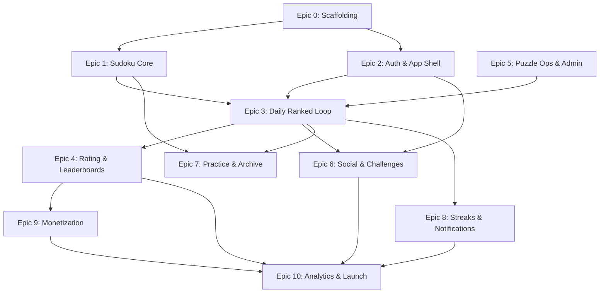

# Competitive Social Sudoku — MVP Epic Plan

**Source:** `competitive_social_sudoku_prd.md` (v0.2)  
**Purpose:** Single execution roadmap organized into main EPICs for agentic and team development.  
**North-star metric:** Weekly active users who complete at least one ranked puzzle and/or challenge another user.

---

## How to Use This Plan

- Epics are ordered by **dependency**. Do not start a later epic until its listed prerequisites are done.
- Each epic maps to PRD sections and release milestones (§31).
- **Epic 0 is mandatory first** — it establishes the monorepo, shared packages, and agent visibility proxies required by §24 and §34.13. CI and deployment are deferred until Epic 3.
- MVP launch is complete only when **Epic 10** acceptance checks pass (§34).

---

## Epic Dependency Overview

---

## Epic 0 — Project Scaffolding & Dev Infrastructure

**Goal:** Runnable local monorepo skeleton and agent-friendly UI proxies — no product features, CI, or cloud deployment yet.

**PRD refs:** §23 (Technical Stack), §24 (Agentic Development Visibility), §34.13  
**Release alignment:** Foundation for all milestones

### Deliverables

| Area | Scope |
|------|--------|
| **Monorepo layout** | `apps/mobile` (Expo RN), `apps/api` (FastAPI), `apps/admin` (protected web dashboard), `packages/sudoku-core` (empty package shell), shared TS/Python tooling |
| **Mobile shell** | Expo + TypeScript + Expo Router; five tab routes (Today, Play, Leaderboard, Social, Profile) with placeholder screens |
| **Backend shell** | FastAPI app with `/api/v1` router, health check, OpenAPI docs, Docker Compose for local Postgres + Redis |
| **Database** | PostgreSQL + Alembic initialized; baseline migration with empty schema placeholder |
| **Auth wiring** | Clerk (or Firebase) integration stub — JWT validation middleware on API, auth provider on mobile (no flows yet) |
| **State & data** | TanStack Query client setup, Zustand store skeleton, MMKV/SecureStore wrappers |
| **Observability** | Sentry on mobile + API; structured logging on backend |
| **Agent proxies** | Expo Web build running in browser; Storybook or `/dev/screens` route scaffold |

### Exit Criteria

- [ ] `docker compose up` starts API + Postgres + Redis locally
- [ ] Mobile app launches on iOS/Android simulator and Expo Web
- [ ] All five tabs navigate in web and native
- [ ] API returns health check; Alembic migrations run cleanly
- [ ] Expo Web loads Today placeholder; Storybook/dev screens route reachable

---

## Epic 1 — Sudoku Core & Gameplay Engine

**Goal:** Shared, test-covered Sudoku logic and a polished playable board — casual mode first, ranked rules enforced client-side (server validates later).

**PRD refs:** §8 (Ranked Ruleset), §9 (Casual/Practice), §13 (Gameplay UX), §23.5 (`packages/sudoku-core`)  
**Release alignment:** Milestone 1 — Gameplay Prototype

### Deliverables

| Area | Scope |
|------|--------|
| **`packages/sudoku-core`** | Puzzle/solution representation, grid validation, unique-solution check, note rules, deterministic serialization, difficulty metadata types, test fixtures |
| **Board UI** | 9×9 grid, givens vs player entries, cell/number-first input modes, number pad with completed-number disabled state |
| **Notes** | Pencil mode toggle, note painting, Auto-Clear Notes (default ON, global setting), no notes in final-answer cells |
| **Ranked rules (client)** | 3-mistake system, immediate wrong-entry detection, correct-entry locking, editable wrong entries, undo (cannot undo locked correct), auto-submit on full valid board |
| **Highlighting** | Row/column/box, matching number, candidate, duplicate/conflict, wrong-entry — no legal-placement or single-candidate assistance |
| **Timer** | Visible timer, hideable UI-only, no pause in ranked context |
| **Casual mode** | Adjustable mistake limit, hints toggle, Auto-Fill Notes toggle, unlimited mistakes option |
| **Accessibility** | Large tap targets, high contrast, color-blind-safe conflict indicators, readable pencil marks |
| **Theme tokens** | Design token foundation; ship one excellent light theme (dark mode if cheap) |

### Exit Criteria

- [ ] `sudoku-core` unit tests cover validation, notes, mistake counting, locking, auto-submit preconditions
- [ ] Board playable end-to-end in casual mode with all input modes
- [ ] Ranked rule set enforced in a local/demo ranked session (no backend)
- [ ] Storybook/dev screens cover: in-progress, 1–3 mistakes, failed attempt, completed board
- [ ] Input modes, notes toggle, wrong-entry state, and completion verified manually via Expo Web or simulator

---

## Epic 2 — Auth, Onboarding & App Shell

**Goal:** Guest-first identity model, account creation, profiles, and navigation shell wired to real auth.

**PRD refs:** §4 (User Types), §5 (Onboarding), §6 (Navigation), §28.1 (User/Profile API)  
**Release alignment:** Milestone 2 (partial)

### Deliverables

| Area | Scope |
|------|--------|
| **Guest sessions** | Anonymous guest ID, local persistence, guest capability restrictions enforced |
| **Auth flows** | Sign up / log in via Clerk; account required gates (ranked submit, rating, leaderboards, permanent history, official share, friend comparison, claim) |
| **Onboarding** | Guest can play sample/casual puzzle without signup; lightweight value prop before auth prompt |
| **User profile** | Username, display name, avatar; `GET /me`, `PATCH /me/profile` |
| **Profile tab** | Settings shell, notification preferences placeholder, account management entry |
| **App shell** | Five tabs fully wired with auth-aware states; deep link route stubs |

### Exit Criteria

- [ ] Guest can open app and play sample puzzle without account
- [ ] Registered user can create account, set username, view/edit profile
- [ ] Auth gates block ranked submission and leaderboard visibility for guests
- [ ] API profile endpoints secured with JWT

---

## Epic 3 — Daily Ranked Puzzle & Server-Owned Attempt Lifecycle

**Goal:** The core competitive loop — one global daily puzzle, preview/start, server-authoritative timing, validation, and provisional results.

**PRD refs:** §7, §10, §11, §25 (Attempt Lifecycle), §26 (Anti-Cheat), §28.2–28.3  
**Release alignment:** Milestone 2 — Ranked Alpha

**Depends on:** Epic 0, Epic 1, Epic 2, Epic 5 (at least one schedulable puzzle)

### Deliverables

| Area | Scope |
|------|--------|
| **Daily puzzle API** | `GET /daily/current`; global reset at fixed UTC; difficulty + estimated solve-time range exposed |
| **Preview flow** | `POST .../preview`; capped timer (30s default); no entries/notes; auto-start only if actively on screen; exit before Begin does not consume attempt |
| **Attempt lifecycle** | States: not_started → previewing → started → in_progress → submitted → validated → provisional_ranked → finalized; terminal: abandoned, timed_out, invalid, under_review, voided |
| **Server timing** | `POST .../start`, `POST .../events`, `POST .../submit`, `POST .../abandon`; official duration = server `submitted_at - started_at`; client timer display-only |
| **One attempt rule** | Started consumes attempt; replay is practice-only |
| **Background behavior** | Timer continues on background; board blur optional; auto-forfeit on daily reset or long safety timeout |
| **Today tab** | Countdown (local time), preview/start CTA, ranked status, post-completion result card shell |
| **Validation** | Server validates submitted grid against solution; mistake count cross-check |
| **Anti-cheat (MVP)** | Conservative absolute solve-time thresholds by difficulty; high-confidence suspicious → under_review, hidden from leaderboard, vague user message |
| **Background jobs** | Cron: activate daily puzzle, finalize daily cohort |
| **CI** | Lint, typecheck, unit test runners for mobile, API, and `sudoku-core`; Playwright job against web build |
| **Deployment** | Render service definitions (API, Postgres, Redis, worker, cron); environment variable templates; staging environment |

### Exit Criteria

- [ ] One global daily puzzle serves all users with correct UTC reset
- [ ] Full ranked attempt lifecycle works server-side with event audit trail
- [ ] Preview does not consume attempt; start does
- [ ] Abandon/timeout handled per PRD (no rating penalty, affects stats)
- [ ] Suspicious ultra-fast times flagged under_review without revealing rules
- [ ] Today screen shows difficulty, solve-time estimate, countdown, result card
- [ ] CI passes on mobile, API, and `sudoku-core`; Playwright captures core ranked flow screenshots
- [ ] Staging deployment on Render runs daily activation and finalization crons

---

## Epic 4 — Rating System, Leaderboards & Post-Game Flow

**Goal:** Competitive credibility — cohort-based rating, multi-view leaderboards, and results-first post-game UX.

**PRD refs:** §14, §15, §17, §28.4–28.5  
**Release alignment:** Milestone 5 — Rating Beta

**Depends on:** Epic 3

### Deliverables

| Area | Scope |
|------|--------|
| **Rating engine** | Start 1000, floor 100; percentile within daily cohort; difficulty multipliers (Easy 0.85, Medium 1.0, Hard 1.1); provisional first 10 completions (+/-80 cap); normal +/-35 cap; small-cohort dampening; `calculation_version` stored |
| **Provisional vs final** | Immediate projected movement after completion; final delta after daily close job |
| **Rating UI** | Provisional label, tier badges (Bronze–Master), rating history on Profile |
| **Leaderboards** | Nearby-my-rank, friends/family, global top, historical read-only; default view logic (challenge context → friends first, else nearby) |
| **Failed attempts** | Private stats only; no public shaming on leaderboard |
| **Post-game flow** | Completion animation → official time → rank/percentile/rating impact → Challenge CTA → leaderboard preview → optional ad slot (placeholder) → replay/practice actions |
| **API** | `GET /daily/{id}/leaderboard`, `GET /daily/{id}/my-result` |

### Exit Criteria

- [ ] Rating updates correctly for percentile performance with all caps and dampening
- [ ] Provisional period (10 puzzles) behaves as specified
- [ ] All four leaderboard views render with correct default selection logic
- [ ] Post-game screen follows results-first flow; share CTA precedes ad placement
- [ ] Historical leaderboard preserved read-only after daily close

---

## Epic 5 — Puzzle Operations, Admin Panel & Content Pipeline

**Goal:** Curated 90-day puzzle inventory with license tracking, review workflow, and automated daily scheduling.

**PRD refs:** §10.2, §10.6, §11, §21, §22, §28.10  
**Release alignment:** Milestone 3 — Content Ops/Admin Alpha

**Depends on:** Epic 0, Epic 1 (`sudoku-core` validation)

### Deliverables

| Area | Scope |
|------|--------|
| **Admin dashboard** | Protected web UI on same FastAPI backend; admin role model |
| **Puzzle import** | CSV/JSON import with grid, solution, difficulty, solve-time range, source/license metadata |
| **Backend validation** | Format, solution correctness, unique solution, duplicate detection, no-guessing suitability checks |
| **Review workflow** | States: imported → needs_review → approved → scheduled → published → archived / rejected; reviewer ID, timestamp, notes |
| **Playtest** | Admin playtest with result saving |
| **Scheduling** | Bulk schedule approved puzzles; table/list view (date, weekday, puzzle ID, difficulty, status, reviewer, license indicator) |
| **Weekly rotation** | Backend-configurable difficulty rotation (Mon Easy … Sun Hard); not hard-coded in client |
| **Inventory** | Process to load ≥90 approved puzzles before public launch |
| **Audit log** | Admin actions recorded |

### Exit Criteria

- [ ] Admin can import, validate, playtest, approve/reject, and bulk-schedule puzzles
- [ ] Every approved puzzle has complete source/license metadata
- [ ] Scheduled puzzle table drives daily activation cron
- [ ] ≥90 puzzles scheduled before launch gate
- [ ] Expert puzzles excluded from daily ranked rotation

---

## Epic 6 — Social, Challenges & Growth Loop

**Goal:** Wordle-style challenge sharing with guest play, result comparison, and friend discovery.

**PRD refs:** §5.2, §16, §28.5–28.6  
**Release alignment:** Milestone 4 — Social Beta

**Depends on:** Epic 2, Epic 3

**Implementation plan (challenge loop):** [docs/plans/epic-6-challenge-loop.md](docs/plans/epic-6-challenge-loop.md) — phased work to close share → play → compare. See also [EPIC_PLAN_UPDATED.md](EPIC_PLAN_UPDATED.md) for current audit status.

### Deliverables

| Area | Scope |
|------|--------|
| **Challenge links** | Create share for daily ranked or archive/casual puzzle; deep link + web landing card (non-playable web) |
| **Guest challenge flow** | Open link → install/open app → preserve context → play as guest → see comparison vs challenger |
| **Guest claim** | Post-signup claim of guest result (`POST .../claim`) |
| **Daily eligibility** | Active daily challenge recipients rating-eligible if attempt unused and window open |
| **Friends** | Friends list, username search, friend requests (accept/decline/remove), profile/invite links |
| **Social tab** | Active/sent/received challenges, friends list, search |
| **Leaderboard filter** | Friends/family filter on daily and historical boards |
| **Analytics hooks** | Challenge funnel events (opened, CTA clicked, started, completed, claimed) |

### Exit Criteria

- [x] User can share challenge link after ranked completion — Social tab + API; post-game Today CTA planned in [challenge loop plan](docs/plans/epic-6-challenge-loop.md) Phase 1
- [ ] Guest recipient completes challenge and sees time comparison — [challenge loop plan](docs/plans/epic-6-challenge-loop.md) Phases 2–4
- [ ] Guest can sign up and permanently claim result — out of scope for challenge-loop plan
- [x] Username search and friend requests work end-to-end
- [x] Challenge context preserved through install/open deep link path

---

## Epic 7 — Practice, Archive & Ghost Rank

**Goal:** Non-ranked retention content — past dailies, practice modes, and unofficial ghost rank for missed days.

**PRD refs:** §9, §12, §28.7  
**Release alignment:** Supports Play tab + retention (between Milestones 2–4)

**Depends on:** Epic 1, Epic 3, Epic 5

### Deliverables

| Area | Scope |
|------|--------|
| **Play tab** | Practice puzzles, archive list, replay completed, casual settings (hints, Auto-Fill Notes, mistake limits) |
| **Archive API** | `GET /archive`, `GET /archive/{id}`, start/submit archive attempts (non-rated) |
| **Historical boards** | Read-only original daily leaderboard with user's original result if played |
| **Ghost rank** | Compute and display unofficial "would have ranked #N" for archive play; clearly marked unofficial; no rating/leaderboard mutation |
| **Upcoming calendar** | Show upcoming difficulty bands only — no puzzle leak |

### Exit Criteria

- [ ] Closed daily puzzles appear in archive as practice-only
- [ ] Archive attempts do not affect rating or historical leaderboard
- [ ] Ghost rank displays with clear unofficial labeling
- [ ] Casual mode supports hints and Auto-Fill Notes per §9
- [ ] Upcoming difficulty visible without exposing puzzle content

---

## Epic 8 — Streaks & Notifications

**Goal:** Daily habit mechanics and timely re-engagement without onboarding spam.

**PRD refs:** §18, §19, §28.8  
**Release alignment:** Retention layer (pre–soft launch)

**Depends on:** Epic 3, Epic 2

### Deliverables

| Area | Scope |
|------|--------|
| **Streak logic** | Extend on official daily completion within global window; global reset timing (not local midnight) |
| **Streak Freezes** | Hold max 2; auto-consume on missed day; earn 1 per 7 official daily completions; no purchase/ads for freezes |
| **Streak UI** | Profile streak display, local countdown ("Today's puzzle ends in…"), freeze count |
| **Push notifications** | Expo Notifications; device registration API; permission prompt only after meaningful action (first ranked completion, first share, etc.) |
| **Notification types** | Daily reminder, friend challenged you, someone beat your time, final ranking ready |
| **Preferences** | `GET/PATCH /notifications/preferences` |

### Exit Criteria

- [ ] Streak extends only on valid daily ranked completion in window
- [ ] Freeze auto-consumes on miss; replenishes every 7 completions; capped at 2
- [ ] Push permission not requested during initial onboarding
- [ ] All four notification types deliver on device (native QA required)

---

## Epic 9 — Monetization (AdMob)

**Goal:** Free-with-ads model that never disrupts the ranked competitive loop.

**PRD refs:** §20, §17 (ad placement in post-game)  
**Release alignment:** Milestone 6 — Monetization Beta

**Depends on:** Epic 4 (post-game flow)

### Deliverables

| Area | Scope |
|------|--------|
| **AdMob SDK** | Integrate on iOS/Android |
| **Allowed placements** | After ranked result + share CTA, after casual completion, archive/practice transitions, after challenge comparison |
| **Blocked placements** | Never during ranked play, preview, before submission, before first result reveal, before first share CTA |
| **Rewarded ads** | Casual/practice benefits only (hints, practice packs, themes) — never ranked retries, rating, streak freezes |
| **Frequency caps** | Conservative caps; no interstitial on app open or before first meaningful action |
| **Consent** | GDPR/ad consent flow |
| **Ad analytics** | ad_requested, ad_shown, ad_completed, ad_failed_to_load |

### Exit Criteria

- [ ] No ad renders during ranked gameplay or preview
- [ ] Post-game ad appears only after result reveal and share CTA
- [ ] Rewarded ads limited to casual benefits
- [ ] Frequency caps enforced
- [ ] Ad consent flow complete for EU users

---

## Epic 10 — Analytics, Legal, Monitoring & Launch Readiness

**Goal:** Instrumentation, compliance, production hardening, and MVP acceptance validation.

**PRD refs:** §29, §30, §31.7–31.8, §34, §35  
**Release alignment:** Milestone 7 (Soft Launch) → Milestone 8 (Public Launch)

**Depends on:** All prior epics

### Deliverables

| Area | Scope |
|------|--------|
| **PostHog** | Client + server event SDK; major funnel events per §29.4 (no full grids, emails, or raw device IDs) |
| **Postgres source of truth** | Authoritative state in DB; PostHog for analytics only |
| **Legal** | Privacy Policy, Terms of Service, community/competitive rules, support email |
| **Privacy** | Account deletion path; anonymized "Deleted Player" on historical leaderboards; GDPR consent; no phone contacts |
| **Monitoring** | Crash reporting (Sentry), backend logging, daily puzzle job alerts, rating finalization alerts, submission error alerts |
| **Production** | Render production services, secrets management, cron reliability |
| **Soft launch** | Real daily schedule, real sharing, analytics dashboards, support flow |
| **Acceptance audit** | Validate all §34 criteria (gameplay, ranked lifecycle, rating, leaderboards, social, streaks, admin, ads, analytics, legal, monitoring, agent proxies) |
| **Agent tooling (final)** | Expo Web navigable for all core screens; Storybook/dev screens for all major states; Playwright screenshot suite |

### Exit Criteria

- [ ] All §34 MVP acceptance criteria pass
- [ ] Required PostHog events fire for ranked, social, streak, and ad funnels
- [ ] Privacy policy, ToS, and account deletion live
- [ ] Production cron jobs stable for 7+ consecutive days in soft launch
- [ ] Soft launch metrics tracked: D1/D7 retention, ranked completion rate, share rate, guest conversion (§35)
- [ ] Native QA sign-off on notifications, AdMob, deep links, backgrounding

---

## PRD → Epic Traceability (Quick Reference)

| PRD Section | Epic |
|-------------|------|
| §5 Onboarding | Epic 2, Epic 6 |
| §6 Navigation | Epic 0, Epic 2 |
| §7 Daily Ranked Puzzle | Epic 3 |
| §8 Ranked Ruleset | Epic 1, Epic 3 |
| §9 Casual/Practice | Epic 1, Epic 7 |
| §10–11 Puzzle Calendar & Fairness | Epic 5 |
| §12 Archive & Ghost Rank | Epic 7 |
| §13 Gameplay UX | Epic 1 |
| §14 Rating | Epic 4 |
| §15 Leaderboards | Epic 4 |
| §16 Social & Challenges | Epic 6 |
| §17 Post-Game Flow | Epic 4, Epic 9 |
| §18 Streaks | Epic 8 |
| §19 Notifications | Epic 8 |
| §20 Monetization | Epic 9 |
| §21–22 Admin & Licensing | Epic 5 |
| §23 Technical Stack | Epic 0 (local), Epic 3 (CI/deploy) |
| §24 Agent Visibility | Epic 0, Epic 10 |
| §25–26 Attempt Lifecycle & Anti-Cheat | Epic 3 |
| §27 Database Entities | Epic 0 (schema), distributed across epics |
| §28 API Contract | Distributed across epics |
| §29 Analytics | Epic 10 |
| §30 Legal/Privacy | Epic 10 |
| §31 Release Plan | Epic ordering above |
| §34 Acceptance Criteria | Epic 10 gate |

---

## Explicit Non-Goals (Do Not Scope Into Epics)

Per §33, the following are **out of MVP** and must not expand epic scope:

- Real-time multiplayer / live head-to-head
- Persistent private groups / mini-leagues
- Phone contact discovery
- Chat / social feeds
- Custom puzzle editor, advanced coaching, tournaments
- Multiple daily ranked puzzles or Expert ranked ladder
- Separate ratings by difficulty/mode
- Advanced anti-cheat case management UI
- Full playable web Sudoku
- Offline ranked mode
- Manual rating/leaderboard moderation UI
- Paid competitive advantages, deep cosmetics
- Haptics and sound

---

## Suggested Sprint Sequencing

| Phase | Epics | Outcome |
|-------|-------|---------|
| **Foundation** | 0 → 1 | Playable board + repo skeleton |
| **Identity** | 2 | Guest-first auth and shell |
| **Content** | 5 (parallel with 1) | Puzzle pipeline ready |
| **Core loop** | 3 → 4 | Daily ranked + rating + leaderboards |
| **Growth** | 6 → 7 → 8 | Social, archive, streaks |
| **Revenue** | 9 | Ads without harming ranked UX |
| **Ship** | 10 | Soft launch → public launch |

---

## Launch Gate Checklist (Epic 10)

Before public launch, confirm:

1. ≥90 approved puzzles scheduled (Epic 5)
2. Stable ranked lifecycle and rating jobs for 7+ days (Epic 3, 4)
3. Challenge links work install → play → compare → claim (Epic 6 — [challenge loop plan](docs/plans/epic-6-challenge-loop.md) + guest claim)
4. All §34 acceptance criteria green
5. Privacy/legal live with account deletion (Epic 10)
6. AdMob validated without ranked disruption (Epic 9)
7. PostHog funnels for retention and social conversion (Epic 10)
8. Agent dev proxies operational for ongoing iteration (Epic 0, 10)
