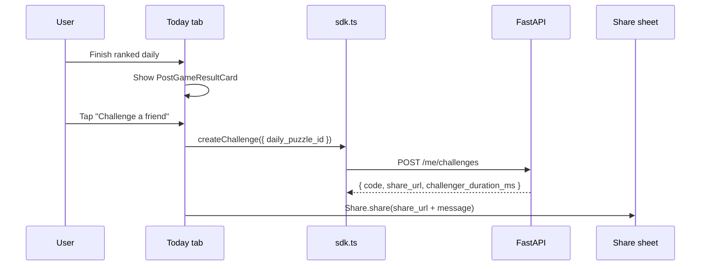
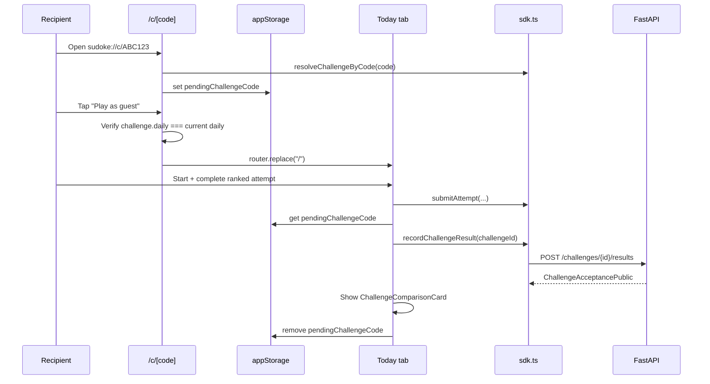

# Epic 6 — Challenge Loop Completion Plan

**Status:** Implemented and code-verified (challenge loop landed 2026-06-26; guest claim landed 2026-06-28)  
**Created:** 2026-06-26  
**Epic:** [Epic 6 — Social, Challenges & Growth Loop](../../EPIC_PLAN_UPDATED.md#epic-6--social-challenges--growth-loop)  
**PRD refs:** §5.2 (Shared Challenge Link Onboarding), §16 (Social and Challenges), §17 (Post-Game Flow), §15.2 (leaderboard default after challenge — stretch)  
**Parent task:** “Finish the challenge loop” (Task 2 from development prioritization)

---

## 1. Goal

Close the **Wordle-style challenge loop** for today’s **Daily Ranked Puzzle**:

1. Challenger finishes ranked daily → shares a link with their official time embedded.
2. Recipient opens the link → app preserves challenge context → plays today’s daily (guest or signed-in).
3. Recipient submits a valid ranked attempt → backend records a **challenge acceptance** with their time.
4. Recipient immediately sees a **head-to-head comparison** (You vs challenger: time, mistakes, win/lose/tie).

This plan covers steps 1–4 plus the final-mile **Guest → account claim** (`POST /me/claim-guest`) needed to permanently attach guest results after signup.

---

## 2. Current state vs target

| Area | Exists today | Gap |
|------|--------------|-----|
| **Create challenge** | `POST /me/challenges`, idempotent per challenger+daily, attaches challenger attempt stats | — |
| **Resolve by code** | `GET /challenges/by-code/{code}` (public) | — |
| **Record result** | `POST /challenges/{id}/results` → `record_acceptance()` with user/guest attempt lookup; mobile retries save from persisted pending code | — |
| **Deep link landing** | `/c/[code]` resolves challenge, stores code + id, checks current daily before play, and shows signed-in/guest-appropriate CTA copy | — |
| **Post-game share** | Today tab and Social tab both create/share challenge links | — |
| **Comparison UI** | Post-game screen shows `ChallengeComparisonCard` after successful acceptance | — |
| **SDK / hooks** | `sdk.recordChallengeResult`, `useCreateChallenge`, `useResolveChallenge`, `useRecordChallengeResult`, `usePendingChallenge` | — |
| **Guest claim** | `POST /me/claim-guest` requires bearer + `X-Guest-Token`, claims challenge acceptances, and attaches non-conflicting ranked attempts | Native/manual E2E still needed |
| **Tests** | Challenge create/resolve plus guest acceptance, daily mismatch, self-challenge, idempotent update, and guest claim tests pass locally | Native/manual E2E still needed |

---

## 3. Scope

### In scope

- Post-game **“Challenge a friend”** on Today tab (authenticated users only).
- Consume **`pendingChallengeCode`** after ranked submit; call **`recordChallengeResult`**.
- **`ChallengeComparisonCard`** on post-game screen when acceptance succeeds.
- **Backend guardrails** on `record_acceptance` (daily match, terminal attempt, no self-challenge, active challenge).
- **Landing screen** daily-eligibility check before routing to play.
- **API + mobile tests** for the happy path and key error cases.
- **Social tab** sent-challenge rows show recipient count / latest acceptance (read-only, uses existing detail endpoint).
- **Guest → account claim** after sign-in so guest challenge results and non-conflicting ranked attempts become permanent account history.

### Out of scope (separate tasks)

| Item | Where tracked |
|------|----------------|
| Non-playable **web** challenge landing (§5.2 step 15) | Infra Epic I6 / Epic 10 |
| Archive/casual challenge links (§16.2 type 30) | Epic 7 extension |
| Push notification “beat your time” | Epic 8 |
| PostHog funnel events (opened → completed) | Epic 10 |
| Leaderboard default `view=friends` after challenge (§15.2) | Stretch — note only |

---

## 4. User flows

### 4.1 Challenger (registered user)



**Rules:**

- Only show share CTA when `status === 'authenticated'` and `me.is_guest === false`.
- Pass explicit `daily_puzzle_id` from the just-completed daily (not rely on “current” on server).
- Re-share is idempotent — same link returned if challenge already exists for that daily.

### 4.2 Recipient via deep link (guest or signed-in)



**Rules:**

- Recording runs only when submitted attempt status is terminal success (`validated`, `provisional_ranked`, `finalized`, or `under_review` with a duration).
- If pending code’s daily ≠ today’s active daily → show explanatory banner; do not call record API.
- Failed/abandoned attempts → keep pending code so user can retry same day.
- Idempotent re-submit updates the same acceptance row (server already supports this).

---

## 5. Implementation phases

Work is split into **five PR-sized phases**. Complete in order; each phase is independently testable.

### Phase 1 — Post-game share CTA (Challenger)

**Files:**

| File | Change |
|------|--------|
| `apps/mobile/src/app/(tabs)/index.tsx` | Wire `onShareChallenge`; use `useCreateChallenge` + `Share.share` |
| `apps/mobile/src/features/daily/PostGameResultCard.tsx` | No structural change — prop already exists |

**Behavior:**

```tsx
// Pseudocode for TodayScreen
const createChallenge = useCreateChallenge();

async function handleShareChallenge() {
  const c = await createChallenge.mutateAsync({ daily_puzzle_id: dailyData.id });
  await Share.share({
    message: `I solved today's Sudoke in ${formatDuration(attempt.official_duration_ms)} — can you beat me? ${c.share_url}`,
    url: c.share_url,
  });
}

// PostGameResultCard props
onShareChallenge={!isGuest && authStatus === 'authenticated' ? handleShareChallenge : undefined}
```

**Acceptance:**

- [x] Authenticated user sees “Challenge a friend” after completing today’s daily.
- [x] Guest does not see the share CTA (sign-in CTA remains).
- [x] Share sheet opens with URL containing the challenge code.
- [x] Creating twice for same daily returns same code (idempotent).

---

### Phase 2 — Pending challenge module (Recipient plumbing)

**New files:**

| File | Purpose |
|------|---------|
| `apps/mobile/src/features/social/pendingChallenge.ts` | Read/write/clear `StorageKeys.pendingChallengeCode`; optional in-memory cache |
| `apps/mobile/src/features/social/usePendingChallenge.ts` | React Query: resolve code → `ChallengeDetailDTO`; expose `dailyPuzzleId`, `challengeId`, `challenger*` |
| `apps/mobile/src/features/social/useRecordChallengeResult.ts` | Mutation wrapper around `sdk.recordChallengeResult` |

**Storage extension (optional but recommended):**

Add `StorageKeys.pendingChallengeId` alongside code to skip a resolve round-trip after landing. Set both in `/c/[code]` when resolve succeeds; clear both on successful record or explicit dismiss.

**New hook API sketch:**

```ts
export function usePendingChallenge(enabled: boolean) {
  // reads code from storage on mount
  // useResolveChallenge(code)
  // returns { code, detail, isLoading, clear, matchesDaily(dailyId: string) }
}

export function useRecordChallengeOnComplete() {
  // returns recordIfPending({ dailyId, attempt }) => Promise<ChallengeAcceptanceDTO | null>
}
```

**Acceptance:**

- [x] Resolving pending challenge exposes challenger display name + duration for UI.
- [x] `matchesDaily(currentDailyId)` returns false when challenge is for a different day (stale link).

---

### Phase 3 — Record acceptance on ranked completion

**Files:**

| File | Change |
|------|--------|
| `apps/mobile/src/app/(tabs)/index.tsx` | After `onCompleted`, call `recordIfPending`; store acceptance in local state |
| `apps/mobile/src/features/daily/DailyAttemptScreen.tsx` | Optional: lift record call to parent only (prefer parent owns side effects) |

**Integration point** — in `TodayScreen` `onCompleted` handler (after `setPhase('completed')`):

1. Load pending code + resolve if needed.
2. If `challenge.daily_puzzle_id !== daily.id` → skip record; set `challengeMismatch` flag for UI.
3. If attempt not in success terminal state → skip.
4. Call `sdk.recordChallengeResult(challenge.id, authCtx)`.
5. On success → `clearPendingChallenge()`; set `acceptance` state.
6. On 4xx → show non-blocking error toast/text; keep code for retry if appropriate.

**Acceptance:**

- [x] Guest recipient: open `/c/{code}` → play → submit → acceptance row created in DB.
- [x] Signed-in recipient: same flow with bearer token.
- [x] Submit without pending code → no extra API call.
- [x] Wrong-day pending code → user sees message, no API error spam.

---

### Phase 4 — Comparison UI

**New file:**

`apps/mobile/src/features/social/ChallengeComparisonCard.tsx`

**Props:**

```ts
interface ChallengeComparisonCardProps {
  readonly challengerName: string;
  readonly challengerDurationMs: number | null;
  readonly challengerMistakes: number | null;
  readonly recipientDurationMs: number;
  readonly recipientMistakes: number;
  readonly outcome: 'win' | 'lose' | 'tie' | 'pending'; // lower time wins; tie-break fewer mistakes
}
```

**Layout (PRD §17 ordering — after personal result, before leaderboard CTA):**

```
┌─────────────────────────────────────┐
│ CHALLENGE RESULT                    │
│ You beat Alex! / Alex wins / Tie    │
│                                     │
│  You          vs        Alex        │
│  4:12 · 0 mistakes      4:38 · 1    │
└─────────────────────────────────────┘
```

**Files:**

| File | Change |
|------|--------|
| `apps/mobile/src/app/(tabs)/index.tsx` | Render card below `PostGameResultCard` when `acceptance` + challenge detail available |
| `apps/mobile/src/features/daily/PostGameResultCard.tsx` | Optionally accept `challengeComparison` slot — or sibling in Today screen |

**Outcome logic (client-side, display only):**

| Condition | Label |
|-----------|--------|
| `recipient_ms < challenger_ms` | “You win!” |
| `recipient_ms > challenger_ms` | “{Name} wins” |
| equal time, fewer mistakes | “You win on mistakes!” |
| equal time, equal mistakes | “Tie!” |
| challenger time null | “You finished — waiting for their time” |

**Acceptance:**

- [x] Comparison visible immediately after successful record.
- [x] Guest sees comparison even without rating block.
- [x] Accessible labels on outcome (not color-only).

---

### Phase 5 — Backend hardening + tests

**File:** `apps/api/src/services/social.py` — extend `record_acceptance`:

| Validation | Error code | HTTP |
|------------|------------|------|
| Challenge `status != active` or past `expires_at` | `challenge_expired` | 409 |
| `attempt` missing or not terminal success | `attempt_not_complete` | 400 |
| `attempt.daily_puzzle_id != challenge.daily_puzzle_id` | `daily_mismatch` | 409 |
| Recipient is challenger (`user.id == challenge.challenger_user_id`) | `self_challenge` | 400 |
| Guest/session mismatch on update | existing ownership checks | 403 |

Terminal success statuses (align with `AttemptStatus`):

- `validated`, `provisional_ranked`, `finalized`, `under_review` (has official duration)

**File:** `apps/api/src/api/v1/challenges.py` — no route changes expected.

**New tests** — `apps/api/tests/test_social_api.py`:

1. `test_record_challenge_acceptance_guest_happy_path` — guest session + completed attempt → acceptance with duration/mistakes.
2. `test_record_challenge_rejects_daily_mismatch` — attempt on different daily → 409.
3. `test_record_challenge_rejects_self` — challenger posts own result → 400.
4. `test_record_challenge_idempotent_update` — second POST updates same row.

**Acceptance:**

- [x] All new pytest cases pass locally / are covered for CI.
- [x] Existing `test_create_and_resolve_challenge` unchanged.

---

### Phase 6 — Landing screen + Social tab polish (landed)

**Landing (`apps/mobile/src/app/c/[code].tsx`):**

- Before `router.replace('/')`, fetch current daily (`sdk.getCurrentDaily`) and compare to `challenge.data.challenge.daily_puzzle_id`.
- If mismatch → inline error: “This challenge was for {date}. Today’s puzzle is different.”
- Store `pendingChallengeId` when resolve succeeds.

**Social tab (`apps/mobile/src/app/(tabs)/social.tsx`):**

- For **Sent** rows: `GET /challenges/{id}` shows acceptance count + latest recipient time.
- Documented that **Received** list only populates after recipient completes (link-based model — no invite table in MVP).

**Stretch (§15.2):** If `pendingChallengeCode` was set this session, navigate to Leaderboard with `view=friends` query — defer unless trivial.

---

### Phase 7 — Guest result claim (landed 2026-06-28)

**Backend (`POST /api/v1/me/claim-guest`):**

- Requires a real authenticated user and `X-Guest-Token`.
- Rejects missing/unknown guest tokens and guest sessions already claimed by another user.
- Idempotently sets `guest_sessions.claimed_at`, `guest_sessions.claimed_by_user_id`, and `users.claimed_from_guest_id` when empty.
- Sets `challenge_acceptances.recipient_user_id` for rows owned by the guest when not already owned by another user.
- Sets `ranked_attempts.user_id` for guest attempts only when the user has no attempt for that same daily; conflicting attempts remain guest-linked to preserve the one-attempt-per-user-per-daily invariant.

**Mobile:**

- `sdk.claimGuest({ bearer, guestToken })` calls the endpoint.
- Auth hydration/sign-in attempts claim once per stored guest token, logs a non-fatal warning on failure, clears the guest token after a successful claim, and refreshes `/me`.

**Tests:**

- Guest challenge acceptance claim.
- Guest ranked attempt claim without conflict.
- Ranked attempt conflict skip.
- Same-user idempotency.
- Already-claimed-by-another-user rejection.

---

## 6. File inventory (summary)

| Path | Action |
|------|--------|
| `docs/plans/epic-6-challenge-loop.md` | This document |
| `apps/mobile/src/app/(tabs)/index.tsx` | Modify |
| `apps/mobile/src/app/c/[code].tsx` | Modify |
| `apps/mobile/src/features/social/pendingChallenge.ts` | **Add** |
| `apps/mobile/src/features/social/usePendingChallenge.ts` | **Add** |
| `apps/mobile/src/features/social/useRecordChallengeResult.ts` | **Add** |
| `apps/mobile/src/features/social/ChallengeComparisonCard.tsx` | **Add** |
| `apps/mobile/src/features/social/useSocial.ts` | Extend (optional exports) |
| `apps/mobile/src/lib/storage.ts` | Add `pendingChallengeId` key (optional) |
| `apps/api/src/api/v1/me.py` | Add `POST /me/claim-guest` |
| `apps/api/src/services/users.py` | Add guest claim transfer helper |
| `apps/api/src/services/social.py` | Modify validations |
| `apps/api/tests/test_social_api.py` | Add tests |

No new migrations required — `challenges` and `challenge_acceptances` tables exist (`0003_social_streaks`).

---

## 7. Error handling & edge cases

| Scenario | UX |
|----------|-----|
| Challenge expired | Banner: “This challenge has expired.” Clear pending code. |
| Challenger hasn’t finished when link created | Share still works; comparison shows “Their time pending” until they complete and re-share (idempotent update refreshes stats). |
| Recipient already used daily attempt before opening link | Normal post-game card; record may attach to the recipient’s existing completed attempt through `_recipient_attempt`. |
| Recipient fails ranked (3 mistakes) | No record call; pending code kept; comparison not shown. |
| Network failure on record | Non-blocking retry button: “Save challenge result”; pending code remains in storage. |
| Claim conflict with existing user daily attempt | Claim succeeds; the guest attempt remains guest-linked and the user's existing daily attempt is preserved. |
| Claim endpoint/network failure after sign-in | Sign-in continues; the app logs a non-fatal warning and keeps the guest token for a future session. |
| Invalid/deleted code on landing | Error copy asks for a resent link; unresolved codes are not saved. |
| Pending challenge not loaded before play starts | Completion path falls back to persisted `pendingChallengeCode` and resolves directly before recording. |

**Verified:** `post_result` now uses `_recipient_attempt(session, user=principal.user, guest=principal.guest, ...)`, so both signed-in and guest recipients attach the completed ranked attempt before `record_acceptance`.

---

## 8. Definition of done (Epic 6 partial exit)

This plan satisfies these exit criteria from [EPIC_PLAN_UPDATED.md](../../EPIC_PLAN_UPDATED.md):

- [x] User can share challenge link after ranked completion — **Phase 1**
- [x] Guest recipient completes challenge and sees time comparison — **Phases 2–4 + guest attempt fix**
- [x] Challenge context preserved through install/open deep link path — already done; **Phase 6** adds daily guard
- [x] Guest can sign up and permanently claim result — **Phase 7**

**Still open after this plan:** non-playable web landing, archive/casual challenge links, push notification “beat your time”, analytics hooks, and native/manual E2E.

---

## 9. Verification notes

Automated coverage includes guest acceptance, daily mismatch, self-challenge rejection, idempotent acceptance update, and guest result claim transfer/conflict/idempotency in `apps/api/tests/test_social_api.py`.

Checks run 2026-06-28 after guest claim:

- `/tmp/sudoke-api-claim-venv/bin/python -m pytest tests/test_social_api.py` from `apps/api` — **13 passed**.
- `/tmp/sudoke-api-claim-venv/bin/python -m ruff check src/services/users.py` from `apps/api` — **passed**. Full touched-file Ruff is still noisy on pre-existing FastAPI `Depends(...)` defaults in `me.py` and older `datetime.timezone.utc` test helpers.
- `pnpm --filter @sudoke/mobile typecheck` — **passed**.
- `pnpm --filter @sudoke/mobile lint` — **passed**.

Manual/native E2E still recommended before marking the loop launch-ready:

1. **Challenger share:** Sign in as User A → complete daily → tap Challenge → share → copy URL.
2. **Guest recipient win:** Fresh install / clear storage → open URL → play as guest → beat challenger time → see comparison “You win”.
3. **Guest recipient lose:** Repeat with slower time → “{Challenger} wins”.
4. **Signed-in recipient:** Open link → sign in first → play → comparison + rating on post-game card.
5. **Guest claim:** Complete a challenge as guest → sign in/create account → verify `/me` refreshes and the result appears under the account.
6. **Stale link:** Change system date or use yesterday’s code against new daily → mismatch message, no crash.
7. **Idempotent share:** User A shares twice → same code in both messages.
8. **Regression commands:** `pytest tests/test_social_api.py`, `pnpm --filter @sudoke/mobile typecheck`, and `pnpm --filter @sudoke/mobile lint`.

---

## 10. Estimated effort

| Phase | Size | Notes |
|-------|------|-------|
| 1 — Share CTA | S (~1–2 hrs) | Mostly wiring |
| 2 — Pending module | S (~2 hrs) | New hooks |
| 3 — Record on complete | M (~3 hrs) | State + error paths |
| 4 — Comparison UI | S (~2 hrs) | Single component |
| 5 — Backend + tests | M (~3 hrs) | **Guest attempt lookup fix is critical** |
| 6 — Polish | S (~2 hrs) | Landing + social rows |
| 7 — Guest claim | S (~2 hrs) | Claim endpoint + mobile hydration |

**Total:** ~1–2 dev days for one engineer.

---

## 11. References

- API routes: `apps/api/src/api/v1/challenges.py`
- Claim route: `apps/api/src/api/v1/me.py` (`POST /me/claim-guest`)
- Claim service: `apps/api/src/services/users.py` (`claim_guest_session`)
- Service: `apps/api/src/services/social.py` (`record_acceptance`, `create_challenge`)
- Mobile SDK: `apps/mobile/src/lib/sdk.ts` (`createChallenge`, `recordChallengeResult`, `resolveChallengeByCode`, `claimGuest`)
- Landing: `apps/mobile/src/app/c/[code].tsx`
- Storage key: `StorageKeys.pendingChallengeCode` in `apps/mobile/src/lib/storage.ts`
- PRD: `competitive_social_sudoku_prd.md` §5.2, §16, §17
